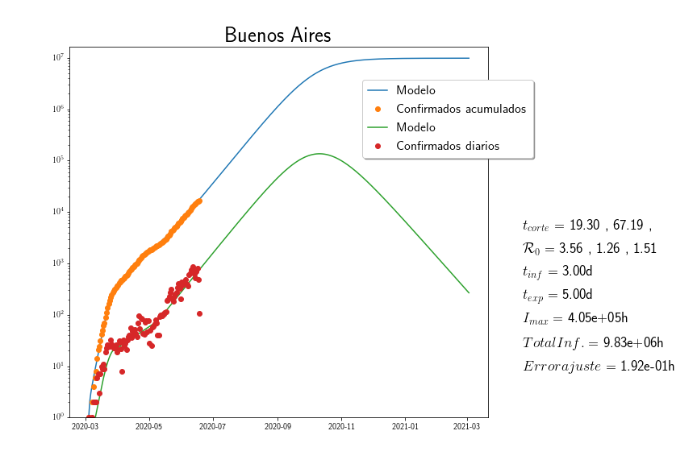
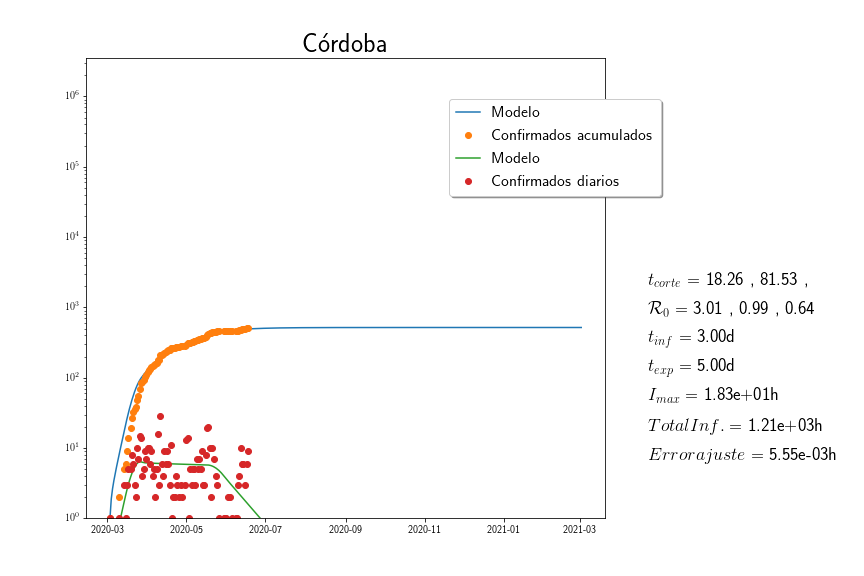

# COVID-19-UNRC
<h2> Paquete para modelizar la epidemia COVID-19 </h2>

El archivo FitSEIR_UNRC.py contiene varias funciones con la finalidad de descargar datos actualizados sobre la pandemia de COVID-19 y ajustar los parámetros de   un modelo SEIR a estos datos.

**Ejemplo de uso**

**Datos Nacionales**

Desde una consola de python (ipython o jupyter-qtconsole)

    >> from FitSEIR_ARG import FitSEIR_ARG, download

Importa las funciones FItSEIR_ARG  y download. La función

    >> download()

descarga datos actualizados de la pandemia desde Ministerio de Salud de la República Argentina.

    >> FitSEIR_ARG(Provincia,Metodo)

Ajusta un modelo SEIR a los datos de "Provincia". "Provincia" es  el nombre de una provincia Argentina.  "Metodo" es el método de optimización que se quiere utilizar,las opciones posibles se indican debajo

**Datos Internacionales**
Desde una consola de python (ipython o jupyter-qtconsole)

    >> from FitSEIR_World import FitSEIR, downloadData

Importa las funciones downloadData para desacragar datos y FItSEIR para ajustar el modelo SEIR a los datos de la pandemia.

    >> downloadData()

Descarga los datos de infectados, recuperados y muertos de todos los paises del mundo.

    >> FitSEIR(Pais,Metodo)

Ajusta un modelo SEIR a los datos de "Pais". "Pais" es  el nombre en ingles del país que se quiere analizar.  "Metodo" es el método de optimización que se quiere utilizar.

**Métodos de optimización**

Se usan métodos de optimización global de la librería ["scipy/optimization"](https://docs.scipy.org/doc/scipy/reference/optimize.html). Los optimizadores globales son lentos de aplicar pero evitan confundir el resultado con mínimos locales. Los métodos que se pueden usar son:

* ["dual_annealing"](https://docs.scipy.org/doc/scipy/reference/generated/scipy.optimize.dual_annealing.html#scipy.optimize.dual_annealing): es la opción por defecto, es un minimizador global estocástico.  Produce un buen resultado en un tiempo algo prolongado pero aceptable
* ["shgo"](https://docs.scipy.org/doc/scipy/reference/generated/scipy.optimize.shgo.html): Produce un resultado rápido pero suele ser no muy bueno.
* ["brute"](https://docs.scipy.org/doc/scipy/reference/generated/scipy.optimize.brute.html#scipy.optimize.brute): Halla prácticamente el mejor ajuste en un tiempo extremedamente largo.

<h2> Modelo SEIR </h2>

<b> Bibliografía </b>

[BCF2019] "Mathematical Models in Population Biology and Epidemiology", Fred Brauer and Carlos Castillo-Chavez and Zhilan Feng, ISBN: 978-14-9399-828-9, Springer Nature,2019.

**Modelo**

SEIR Susceptibles-Expuestos-Infectados-Removidos por la enfermedad.  El modelo es básicamente el de sección 2.5 de [BCF2019].

Sólo es necesario modelar las tres primeras  ecuaciones

**Requerimientos**
Se utilizan las siguientes librerías de Python
1. [Numpy](https://numpy.org/)
2. [SciPy](https://www.scipy.org/)
3. [MatPlotLib](https://matplotlib.org/)
4. [Pandas](https://pandas.pydata.org/)
5. [Datetime](https://docs.python.org/3/library/datetime.html)
6. [Requests](https://pypi.org/project/requests/)

La distribución de software libre [anaconda](https://www.anaconda.com/) instala todos estos recursos.

**Resultado**

