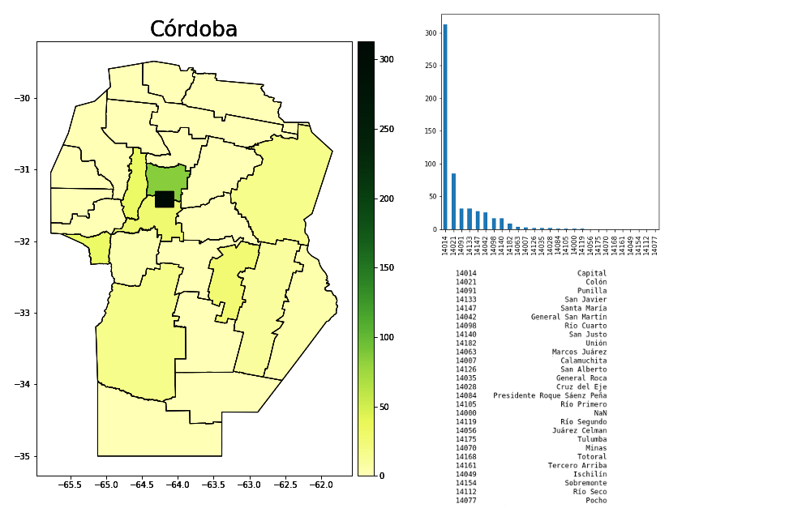
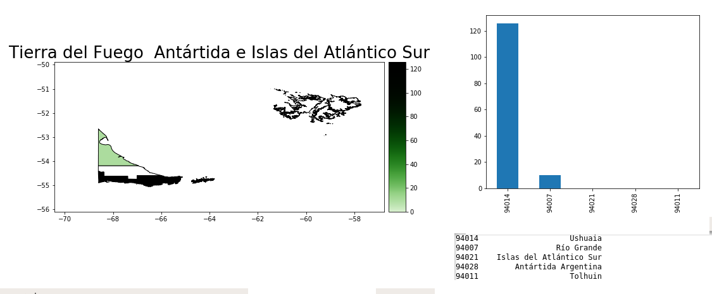
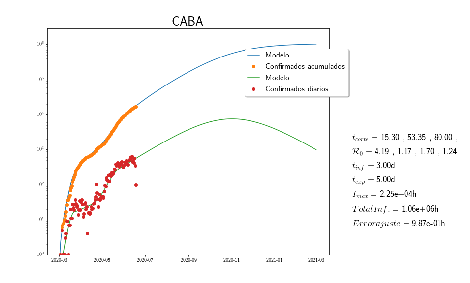
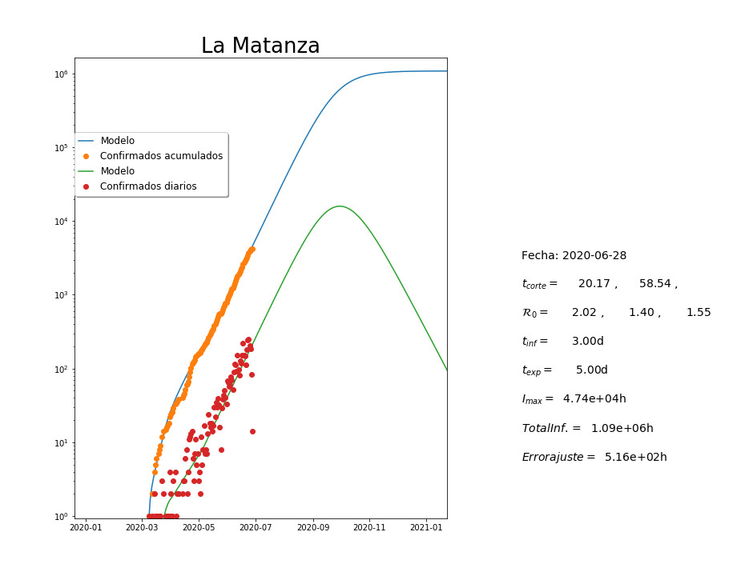
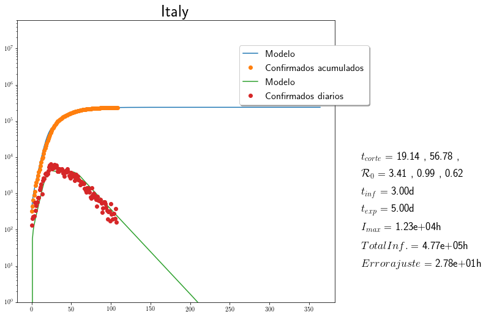
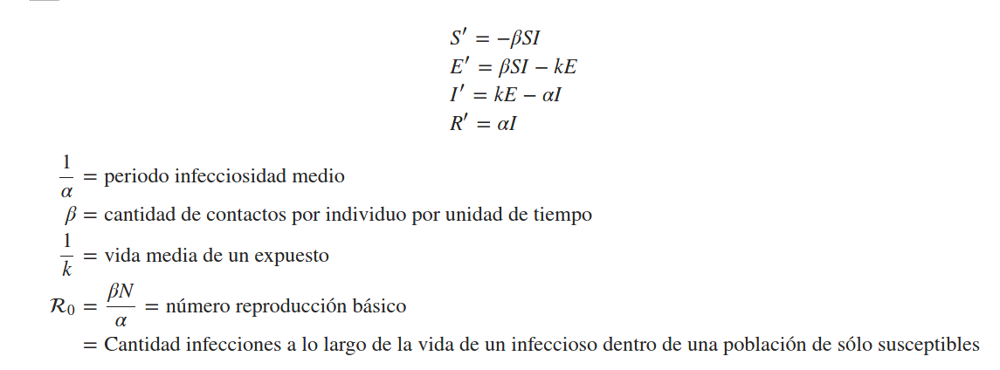

# COVID-19
<h1> Librería para modelizar y visualizar la epidemia COVID-19 </h1>

Se proveen dos modulos, uno de modelización y uno de visualización.

* FitSEIR.py: contiene varias funciones con la finalidad de descargar datos mundiales y Argentinos ([Ministerio de Salud de la República Argentina](https://www.argentina.gob.ar/salud)), actualizados sobre la pandemia de COVID-19 y ajustar los parámetros de   un modelo SEIR a estos datos.

* MapCOVID.py: contiene funciones para mostrar en mapas la situación de la pandemia en la República Argentina.

<h2> Módulo de visualización </h2>

**Ejemplo de uso**

En todos los ejemplos debajo se asume que estamos en una terminal o consola de comandos posicionados en el directorio donde se descargaron los archivos. Se recomienda tener actualizada la base de datos de contagios como se señala en la sección [Datos Nacionales](#item1).

Para importar la función principal.

    >> from MapCOVID import MapaCOVID

Para confeccionar un mapa de casos confirmados acumulados

    >> MapaCOVID(Provincia,campo='confirmado')

donde "Provincia" indica el nombre de una provincia Argentina o la región del AMBA. El resultado es el siguiente

Se muestra la distribución geográfica de los casos confirmados acumulados de la provincia distinguiendo cromáticamente departamentos acorde a la cantidad de contagios.

Llamando a la función con la opción fecha='AAAA-MM-DD' muestra los datos de la fecha consignada en 'AAAA-MM-DD'.

    >> MapaContagios(Provincia,campo='confirmado',fecha='AAAA-MM-DD')

Sin la asignación campo='confirmado' el mapa corresponde a todos los testeo realizados

    >> MapaCOVID("Córdoba")

    >> MapaCOVID("Tierra del Fuego  Antártida e Islas del Atlántico Sur",campo='confirmado')

<h2> Actualización Datos </h2>

**Datos Nacionales**

Desde una consola de python (ipython o jupyter-qtconsole)

    >> from FitSEIR import downloadARG

Importa la función "downloadARG".

    >> downloadARG()

descarga datos actualizados de la pandemia desde [ Ministerio de Salud de la República Argentina](http://datos.salud.gob.ar/dataset/covid-19-casos-registrados-en-la-republica-argentina/archivo/fd657d02-a33a-498b-a91b-2ef1a68b8d16)

**Datos Internacionales**
Desde una consola de python (ipython o jupyter-qtconsole)

    >> from FitSEIR import downloadWorld

Importa la función downloadWorld para descargar datos desde [The Humanitarian Data Exchange](https://data.humdata.org/)

    >> downloadData()

Descarga los datos de infectados, recuperados y muertos de distintos  paises del mundo.

<h2> Ajustando Modelo SEIR a los datos </h2>

<h3>Datos Nacionales</h3>

    >> from FitSEIR import FitSEIR
    >> FitSEIR(Provincia="pcia_nam",dpto="dpto_nam",Metodo="met_nam")

Ajusta un modelo SEIR a los datos de "pcia_nam". "pcia_nam" es  el nombre de una provincia Argentina.  Opcionalmente, el argumento dpto="dpto_nam" ajusta datos del departamento "dpto_nam" de "pcia_nam". También opcionalmente, Metodo="met_nam" cambia el método de optimización que se quiere utilizar,las opciones posibles se indican debajo

**Ejemplo**

    >> FitSEIR(Provincia="CABA")

    >> FitSEIR(Provincia="Buenos Aires",dpto='La Matanza')

<h3>Datos Internacionales</h3>

    >> FitSEIR(Pais="pais_nam",Metodo="met_nam")

Ajusta un modelo SEIR a los datos de "pais_nam". "pais_nam" es  el nombre en ingles del país que se quiere analizar. El argumento opcional Metodo="met_nam" modifica  el método de optimización.

**Ejemplo**

    >> FitSEIR(Pais='Italy')

**Métodos de optimización**

Se usan métodos de optimización global de la librería ["scipy/optimization"](https://docs.scipy.org/doc/scipy/reference/optimize.html). Los optimizadores globales son lentos de aplicar pero evitan confundir el resultado con mínimos locales. Los métodos que se pueden usar son:

* ["dual_annealing"](https://docs.scipy.org/doc/scipy/reference/generated/scipy.optimize.dual_annealing.html#scipy.optimize.dual_annealing): es la opción por defecto, es un minimizador global estocástico.  Produce un buen resultado en un tiempo algo prolongado pero aceptable
* ["shgo"](https://docs.scipy.org/doc/scipy/reference/generated/scipy.optimize.shgo.html): Produce un resultado rápido pero suele ser no muy bueno.
* ["brute"](https://docs.scipy.org/doc/scipy/reference/generated/scipy.optimize.brute.html#scipy.optimize.brute): Halla prácticamente el mejor ajuste en un tiempo extremedamente largo.

**Modelo SEIR**

<b> Bibliografía </b>

[BCF2019] "Mathematical Models in Population Biology and Epidemiology", Fred Brauer and Carlos Castillo-Chavez and Zhilan Feng, ISBN: 978-14-9399-828-9, Springer Nature,2019.

<b>Modelo</b>

SEIR Susceptibles-Expuestos-Infectados-Removidos por la enfermedad.  El modelo es básicamente el de sección 2.5 de [BCF2019].

<h2>Créditos</h2>

**Bases Externas**

Los programas implementan funciones para descargar los datos de la infección. Las fuentes son:

* [Ministerio de Salud, Argentina](http://datos.salud.gob.ar/dataset/covid-19-casos-registrados-en-la-republica-argentina/archivo/fd657d02-a33a-498b-a91b-2ef1a68b8d16)

* [The Humanitarian Data Exchange](https://data.humdata.org/).

Los mapas requieren bases geográficas obtenidas del  

* [Instituto Geográfico Nacional](https://www.ign.gob.ar/NuestrasActividades/InformacionGeoespacial/CapasSIG).

Estas bases no requieren actualizaciones frecuentes y son proporcionados con esta librería. Se corrigieron algunos errores a las bases originales del IGN y a partir de las bases del IGN se confeccionó un base para los distritos que conforman el AMBA.

**Librerías de Python**

Se utilizan las siguientes

1. [Numpy](https://numpy.org/)
2. [SciPy](https://www.scipy.org/)
3. [MatPlotLib](https://matplotlib.org/)
4. [Pandas](https://pandas.pydata.org/)
5. [Geopandas](https://geopandas.org/)
6. [Datetime](https://docs.python.org/3/library/datetime.html)
7. [Requests](https://pypi.org/project/requests/)
8. [sys](https://docs.python.org/3/library/sys.html)

La distribución de software libre [anaconda](https://www.anaconda.com/) instala la mayoría de estos recursos y un package manager que permite obtener aquellos que falten.
